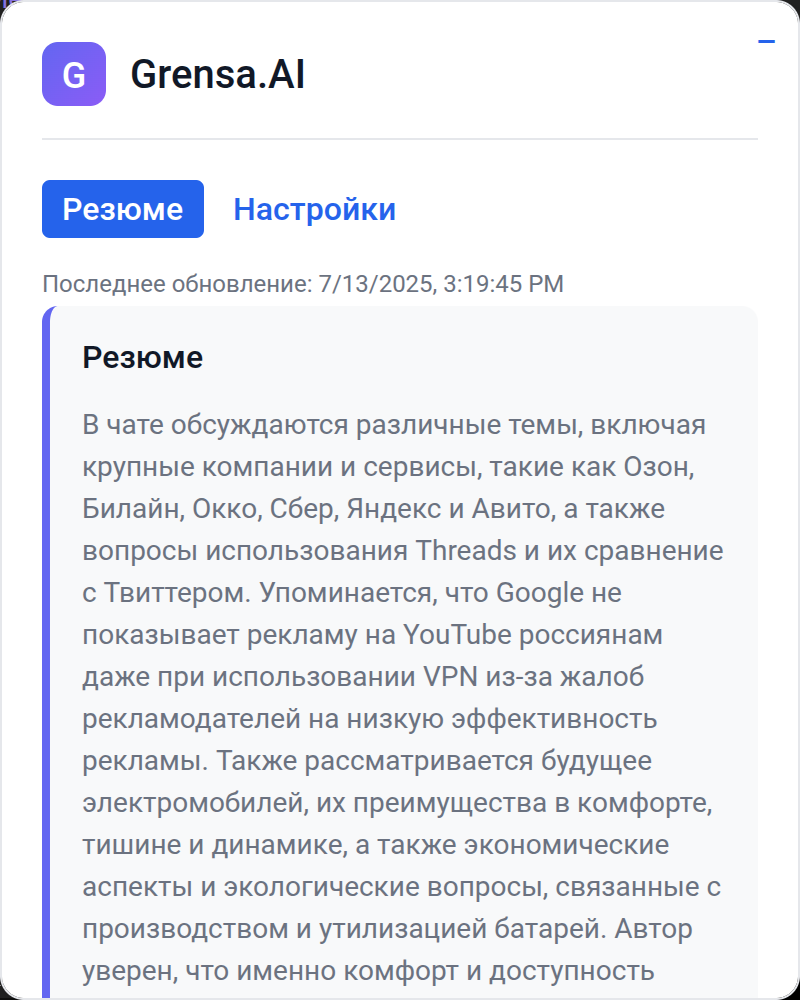
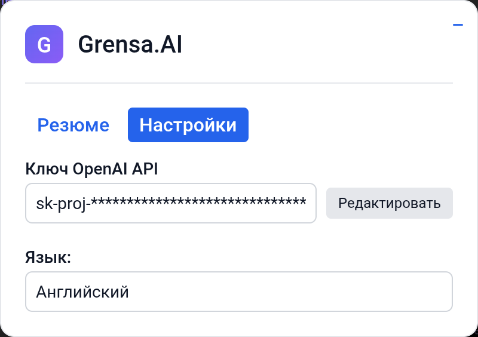

## Выполненные задачи

### Основные задачи (обязательные)

- [x] Парсинг чата и генерация резюме через OpenAI API
- [x] Отображение резюме в окне расширения
- [x] Автоматическое обновление при смене чата
- [x] Состояние загрузки с индикатором

### Дополнительные задачи (по выбору)

- [ ] История резюме
- [ ] Генерация предлагаемых сообщений
- [ ] Перетаскиваемое окно расширения
- [x] Кнопки скрытия/показа расширения
- [x] Переводчик с настройками
- [x] Кэширование резюме для экономии запросов

## Опционально - Описание изменений

1. **Парсинг чатов Telegram и генерация резюме**:
   - Функция `extractChat` (`utils/extractChat.js`) анализирует DOM чата Telegram для извлечения идентификатора чата, участников, сообщений и типа чата (групповой или личный). Она повторяет попытки до 10 раз с задержкой в 1 секунду, чтобы убедиться, что интерфейс Telegram загружен.
   - Функция `getSummary` (`background/openai.js`) проверяет наличие кэшированного резюме с помощью `ChatSummaryCache`. Если кэш отсутствует или запрошен принудительный обновление, вызывается `fetchAndCacheSummary` для отправки данных чата в OpenAI API (модель `gpt-4.1-nano`), а результат кэшируется с идентификатором чата и количеством сообщений.
   - Резюме генерируются на русском языке (согласно `PROMPTS.en`), с акцентом на ключевую информацию, такую как контакты, ссылки и инструкции, в 4-5 кратких предложениях.

2. **Отображение резюме в расширении**:
   - Компонент `SummaryPage` (`pages/Summary.js`) отображает резюме в стилизованном контейнере с анимацией загрузки (скелетон). Показываются ошибки, если запрос к API не удался, а также метаданные (например, время последнего обновления, статус кэша).
   - Кнопка обновления/повтора отображается, если резюме кэшировано или произошла ошибка, позволяя пользователю запросить новое резюме.

3. **Автоматическое обновление при смене чата**:
   - Хук `useHashChange` (`hooks/useHashChange.js`) опрашивает `window.location.hash` каждую секунду для обнаружения смены чата (поскольку Telegram Web не вызывает событие `hashchange`). При изменении хэша вызывается `extractChat` для получения новых данных чата, что инициирует обновление резюме.

4. **Состояние загрузки с индикатором**:
   - Компонент `Summary` (`Components/Summary/Summary.js`) показывает анимацию загрузки (скелетон) с эффектом мерцания во время получения данных. Отображается локализованное сообщение "Суммирование...", сообщение об ошибке (если есть) или текст резюме после загрузки.

5. **Кнопки скрытия/показа**:
   - Компонент `AppContent` (`AppContent.js`) включает кнопку минимизации (`−`) для скрытия интерфейса расширения. Виджет можно снова показать, нажав на иконку расширения, которая отправляет сообщение `show-widget` в content script, вызывая событие `show-extension-widget` для переключения видимости.

6. **Переводчик с настройками**:
   - Интернационализация реализована с использованием `i18next` и `react-i18next` (`i18n.js`). Расширение поддерживает переводы на английский и русский языки, с определением языка из `chrome.storage.sync` (`app_language`) или настроек браузера.
   - Компонент `SettingsPage` (`pages/Settings.js`) включает выпадающий список (`CustomDropdown`) для переключения языка, обновляя интерфейс и сохраняя выбор в `chrome.storage.sync`.

7. **Кэширование резюме**:
   - Класс `ChatSummaryCache` (`cache/index.js`) сохраняет резюме в `chrome.storage.local` с ключами вида `chat_${chatId}`. Сохраняются текст резюме, количество сообщений и временная метка.
   - Функция `checkCache` извлекает кэшированные резюме, а `fetchAndCacheSummary` сохраняет новые. Кэшированные резюме используются, если не запрошено принудительное обновление, с отображением предупреждения о кэше в интерфейсе.

## Инструкции по тестированию

1. **Сборка расширения**:
   - Выполните `yarn build` для создания производственной сборки в папке `build/`.

2. **Загрузка в Chrome**:
   - Откройте Chrome и перейдите в `chrome://extensions/`.
   - Включите "Режим разработчика" и нажмите "Загрузить распакованное расширение".
   - Выберите папку `build/` для загрузки расширения.

3. **Тестирование на Telegram Web**:
   - Откройте https://web.telegram.org и войдите в свой аккаунт Telegram.
   - Откройте групповой или личный чат, чтобы проверить, появляется ли виджет расширения в правом верхнем углу.
   - Убедитесь, что резюме загружается автоматически (с анимацией загрузки) и отображает ключевые детали чата.
   - Перейдите на вкладку "Настройки", чтобы изменить язык (английский/русский) и проверить обновление интерфейса.
   - Введите действительный ключ OpenAI API в вкладке "Настройки", сохраните его и убедитесь, что резюме обновляется без ошибок.
   - Сверните виджет, нажав кнопку "−", и щелкните на иконку расширения в Chrome, чтобы снова его показать.
   - Переключайтесь между чатами, чтобы убедиться, что резюме автоматически обновляется (может занять несколько секунд из-за опроса хэша).
   - Проверьте, что кэшированные резюме отображаются с предупреждением "Кэшированное резюме" и кнопкой "Получить новое резюме".
   - Принудительно обновите резюме, нажав кнопку "Получить новое резюме", и убедитесь, что новое резюме загружается.
   - Проверьте обработку ошибок, удалив ключ API из `chrome.storage.local` (через вкладку Application в DevTools Chrome) и попытавшись получить резюме.

## Опционально - Скриншоты/Демо

## Опционально - Известные проблемы

1. **Задержка опроса хэша**:
   - Хук `useHashChange` опрашивает хэш каждую секунду, что может вызывать небольшую задержку при обнаружении смены чата. Это необходимо, так как Telegram Web не всегда вызывает событие `hashchange`.

2. **Зависимость от DOM**:
   - Функция `extractChat` полагается на конкретные селекторы DOM Telegram, которые могут сломаться при обновлении интерфейса Telegram.

3. **Безопасность API-ключа**:
   - Ключ OpenAI API хранится в `chrome.storage.local` в незашифрованном виде и отправляется в запросах API.

4. **Инвалидация кэша**:
   - Кэш не обновляется автоматически при добавлении новых сообщений в чат, если пользователь не запрашивает принудительное обновление. Это может привести к устаревшим резюме при частом обновлении чата.

5. **Нереализованные функции**:
   - История резюме, генерация предлагаемых сообщений и перетаскиваемое окно не реализованы, так как они были опциональными и отсутствуют в предоставленном коде.

6. **Неправильное определение участников беседы моделью**:
   - Порой модель определяет мои сообщения - как сообщения собеседника, хотя с точки зрения связей через id, проблем быть не должно, возможно стоило переопределить senderId в senderName.

---
